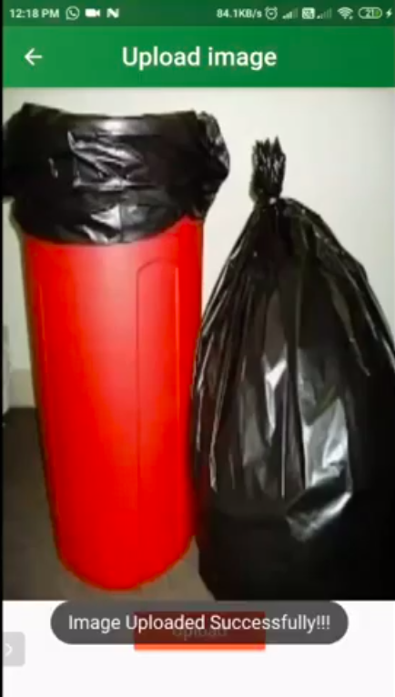
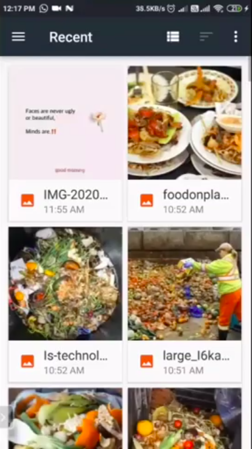
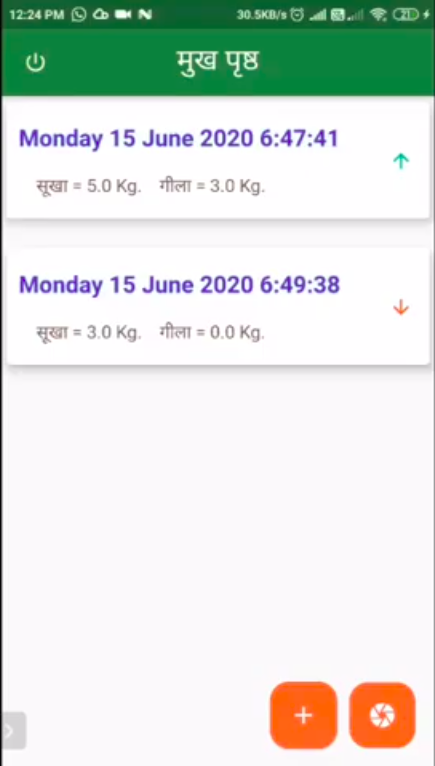

# ComePost

In current scenario, the leftover food is thrown in the trash, especially from hotels and restaurants, there are bulk food wastage observed,
this causes an increase in the size of dump yards, due to it there are many diseases which can be caused, 
so the solution is that we can provide the leftover food to the compost makers by which they can manufacture/produce the compost in low cost and sell it to farmers when the farmer's get the compost in low cost,
they can to sell the vegetables and fruits in low lost, we too include some government schemes in the project.

Youtube Link
https://youtu.be/wEiHG5rgDhs

## Screenshots and Features

 
  
 
 
 
 

 

## Tech Stack
 

**Client:** Flutter, Dart, Provider

**Server:** Spring Boot,Java

**Database:** PostgreSQL

## Badges

